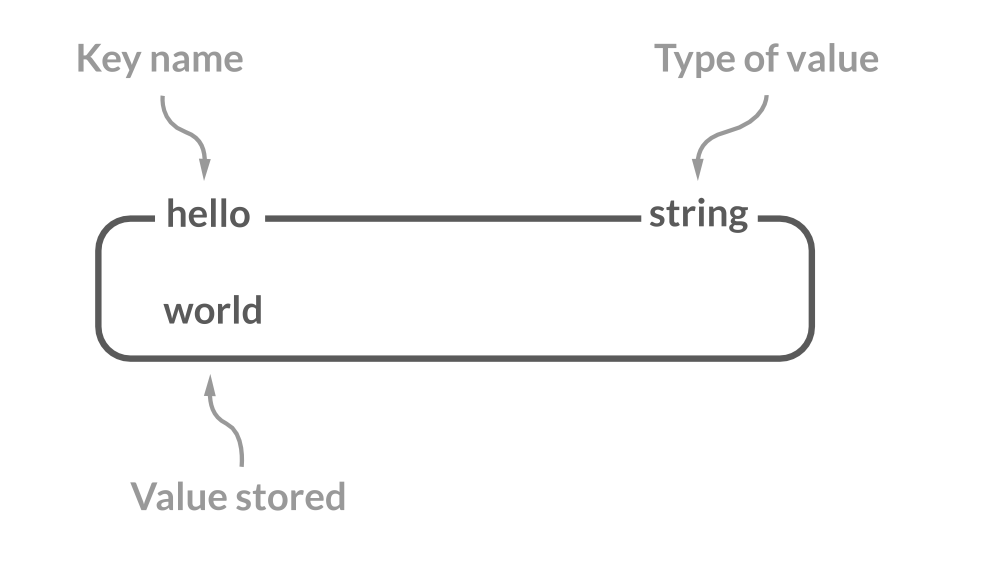
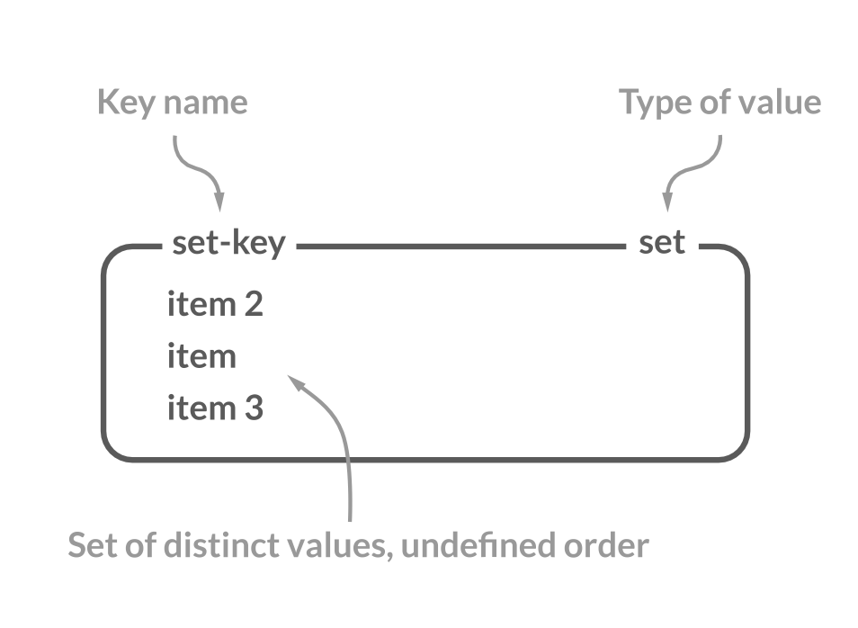
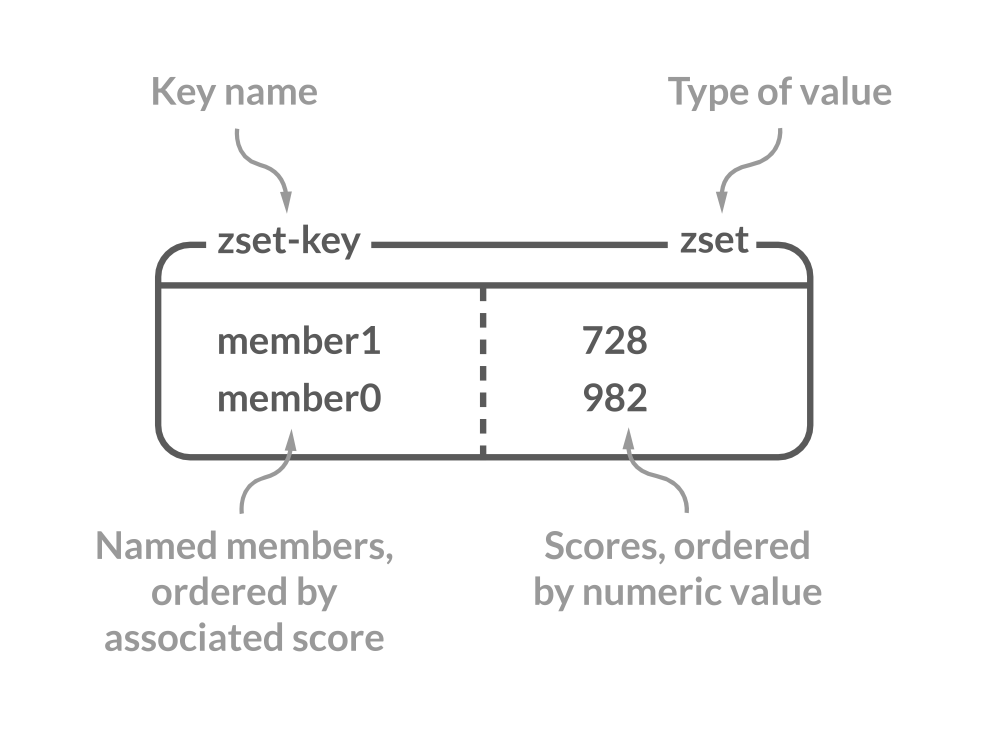
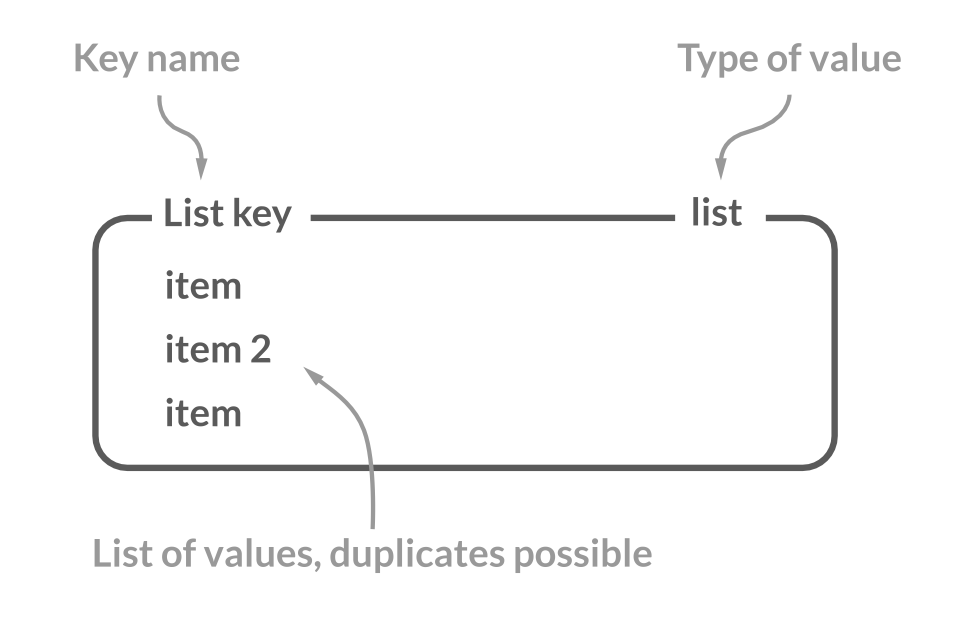
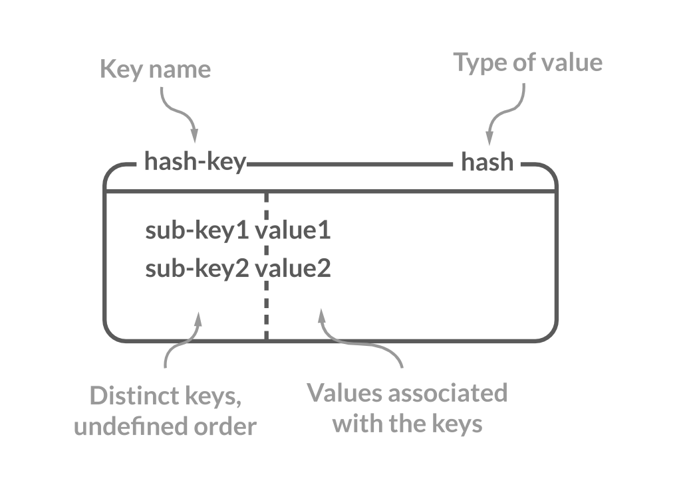

# pydb
implement simple redis server using python

## 데이터 저장
The Redis basic data structure is a hashmap though it supports several types of nested structures. Like a map with lists in the values.


종료 시 snapshot 저장, 다시 실행 시 해당 데이터 메모리로 올림

## data structure

### string



Array data structure of bytes that stores a sequence of elements, typically characters, using some character encoding.

It can store any data (a string, integer, floating point value, JPEG image, serialized Ruby object, or anything else you want it to carry).

Operate on a whole string or parts, and increment or decrement integers and floats.

### set


Unique set of members.

---

### sorted set

A unique set of members orderd by floating point scores.

---

### list

Holds collections of string elements sorted according to their order of insertion

---

### hash

A data type that represents a mapping between a string field and a string value


## worries
python input 으로 전달되는 값을 어떻게 구분하는가? 
```
set a [1,2,3]
vs
set a "[1,2,3]"
```

transaction process